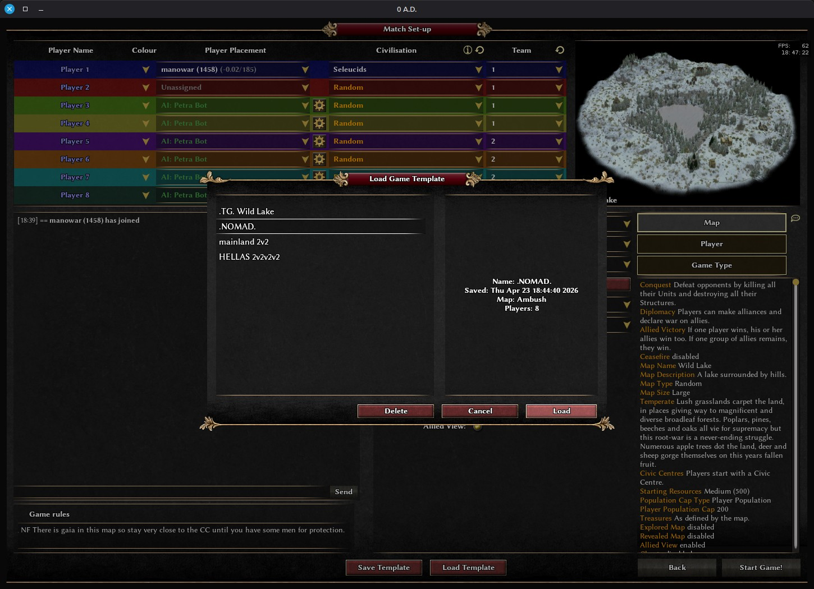
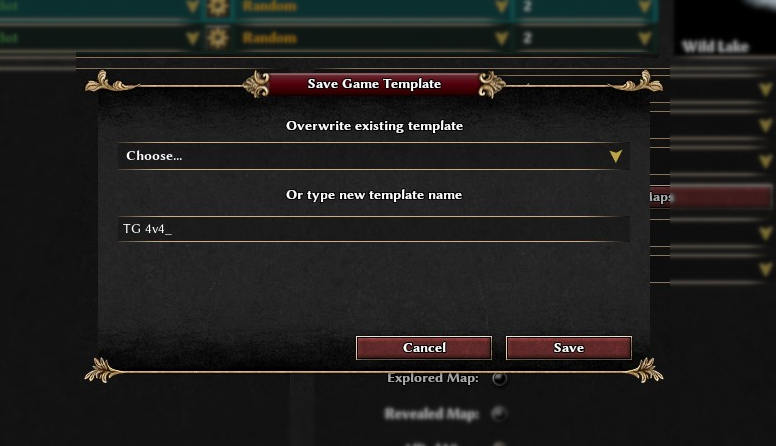
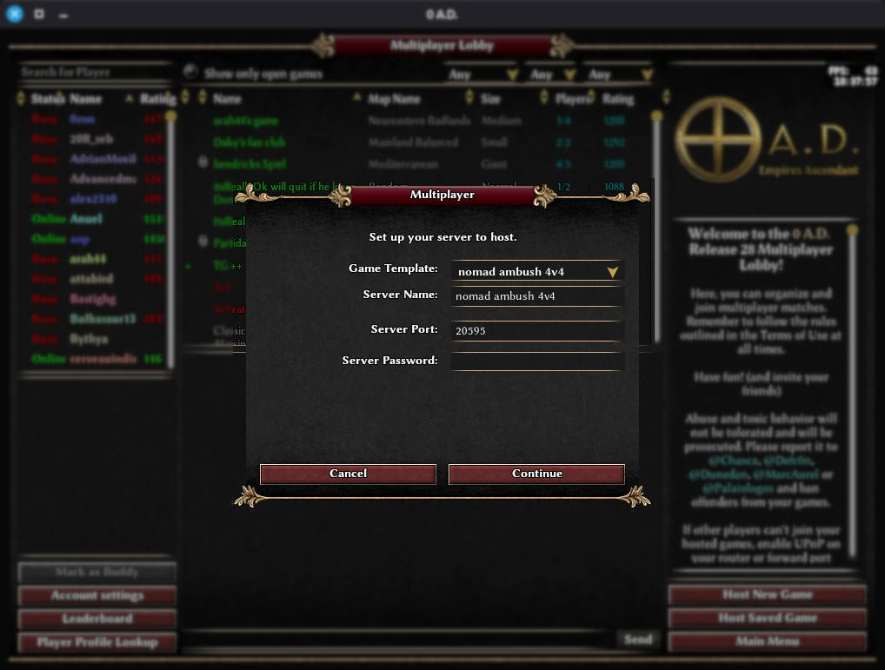
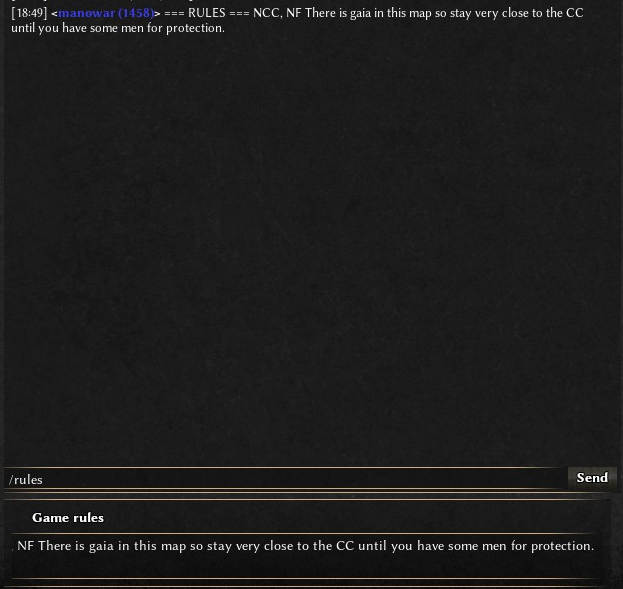

# Game Templates Mod

This is a mod for 0 A.D. that allows saving and loading multiplayer game templates.

## Features
- When you are happy with your game settings save them as a template
- Load game settings quickly without having to change many options
- Easily switch between hosting a variety of game types
- Save game rules and print them to the chat with a slash command (`/rules`) 
- Only the game host needs the mod
- Game templates are stored on your local machine as JSON so they are private to you 


## Screenshots







## Usage
Copy the contents of the `gametemplates` folder to your mods directry (e.g. `/home/$USER/.local/share/0ad/mods` on Linux)


## Where are my game templates

On Linux with a Flatpak install they are at:
```
/home/$USER/.var/app/com.play0ad.zeroad/data/0ad/mods/user/moddata/game_templates/game_templates.mp.json
```
Non-Flatpak will likely store under `.local/share/0ad`

